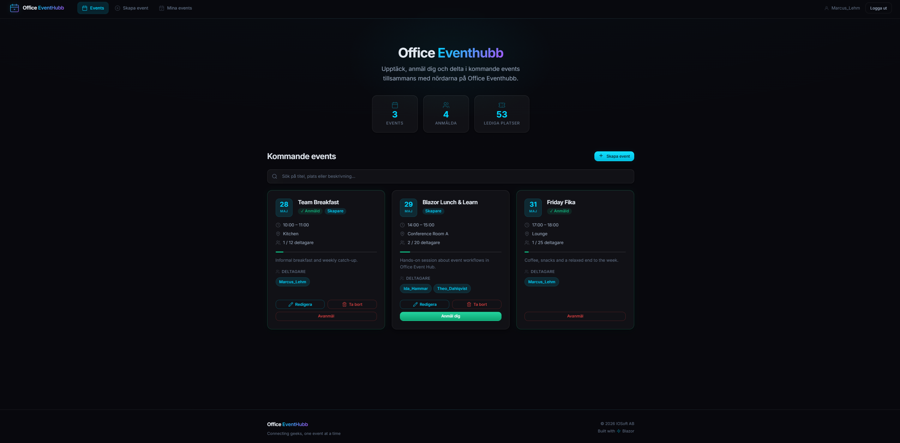
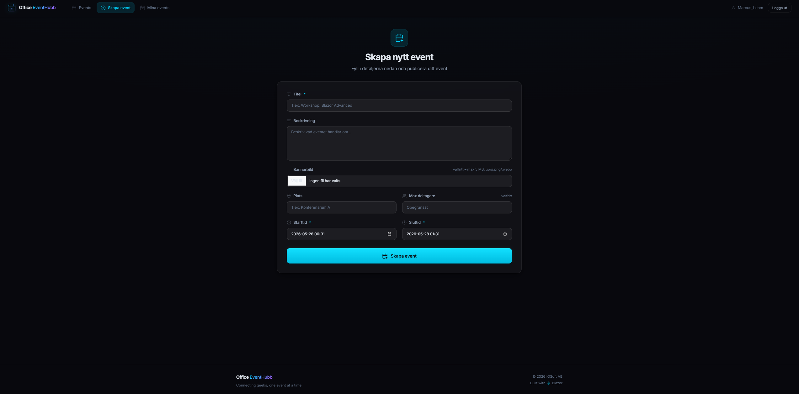
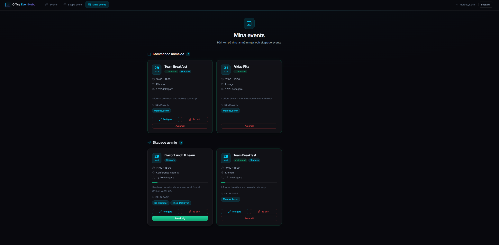

<div align="center">


# Office Event Hub

**An event management platform for offices — built on .NET 10, .NET Aspire, Blazor Server and Clean Architecture.**

[](https://dotnet.microsoft.com/)
[](https://learn.microsoft.com/dotnet/aspire/)
[](https://learn.microsoft.com/aspnet/core/blazor/)
[](https://learn.microsoft.com/ef/core/)
[](https://www.microsoft.com/sql-server)
[](https://opentelemetry.io/)
[](https://xunit.net/)
[](#about-this-repository)

</div>

---

## About this repository

> This repository serves as a **public showcase** for Office Event Hub. The full source code is kept private. If you'd like a code walkthrough or technical deep-dive, feel free to [reach out](#-contact).

Office Event Hub is a personal project I built to dig deeper into modern .NET — specifically **.NET Aspire** for distributed app orchestration, **Clean Architecture** with a rich domain model, and **CQRS-style** use cases.

---

## What is Office Event Hub?

A web application for organizing and registering for events inside an office or company. Employees can create events (workshops, after-works, talks, lunches), invite colleagues, set a maximum number of attendees, and upload a banner image. Other users browse upcoming events, register or unregister with one click, and see live updates as the list changes.

### Core features

- **Create, edit and delete events** with title, description, location, start/end time and optional attendee cap
- **Banner image upload** per event — stored on disk and served by the web frontend
- **Register & unregister** for events with one click
- **Attendee management** — event creators can remove attendees if needed
- **"My events" view** — see everything you've created or signed up for
- **Real-time updates** — when an event is created, updated, deleted or someone registers, all connected clients see the change immediately via an in-process notifier
- **Authentication** with ASP.NET Identity (register, log in, manage profile)
- **Validation everywhere** — business rules enforced in the domain itself, not in controllers

---

## Screenshots

<div align="center">

<!-- Replace these placeholders with real screenshots once captured -->

*Upcoming events view — browse and register*


*Event detail page with attendee list*


*Create event form*


*My events — events you've created or registered for*


</div>

---

## Tech stack

| Layer | Technologies |
|---|---|
| **Platform** | .NET 10, C# with nullable reference types |
| **Orchestration** | .NET Aspire 13.1 — AppHost, service discovery, health checks |
| **API** | ASP.NET Core Minimal APIs, OpenAPI |
| **UI** | Blazor Server, Razor components, scoped CSS per component |
| **Persistence** | Entity Framework Core 10, SQL Server (auto-provisioned via Aspire) |
| **Authentication** | ASP.NET Core Identity |
| **Observability** | OpenTelemetry — metrics, traces and logs from ASP.NET, HTTP and runtime |
| **Resilience** | `Microsoft.Extensions.Http.Resilience` — retry, timeout, circuit breaker |
| **Testing** | xUnit, NSubstitute, **Testcontainers for SQL Server** — real database in integration tests |

---

## Architecture

The solution is structured around **Clean Architecture**, with dependencies pointing strictly inward. The compiler enforces the direction — EF Core can't be used in the Application or Domain layers because the package isn't referenced there.

```
┌─────────────────────────────────────────────────────────┐
│  Office Event Hub.AppHost                               │
│  .NET Aspire orchestration — provisions SQL Server,     │
│  starts API + Web, wires service discovery & health     │
└──────────┬───────────────────────────────┬──────────────┘
           │                               │
           ▼                               ▼
┌────────────────────────┐  ┌──────────────────────────────┐
│  Office Event Hub.Api  │  │  Office Event Hub.Web        │
│  Minimal API endpoints │  │  Blazor Server + auth        │
└──────────┬─────────────┘  └────────────┬─────────────────┘
           │ both reference              │
           ▼                             ▼
┌─────────────────────────────────────────────────────────┐
│  Office Event Hub.Infrastructure                        │
│  EF Core, ASP.NET Identity, persistence                 │
└──────────────────────────┬──────────────────────────────┘
                           │
                           ▼
┌─────────────────────────────────────────────────────────┐
│  Office Event Hub.Application                           │
│  Commands, Queries, Use Cases, abstractions             │
│  (CreateEvent, UpdateEvent, RegisterForEvent, ...)      │
└──────────────────────────┬──────────────────────────────┘
                           │
                           ▼
┌─────────────────────────────────────────────────────────┐
│  Office Event Hub.Domain                                │
│  Rich domain model — Event, EventRegistration, Result   │
│  No external dependencies                               │
└─────────────────────────────────────────────────────────┘
```

### Patterns and techniques worth highlighting

**Rich domain model**
`Event` is an *aggregate root* with private setters, a static `Create` factory, and methods like `Register`, `Unregister`, `RemoveAttendee` and `Update`. Business rules — *start time must be in the future*, *end must be after start*, *can't register twice*, *can't register when full* — are enforced inside the domain, not at the edges. The aggregate owns its registrations and exposes them as `IReadOnlyList<EventRegistration>`.

**CQRS-style use cases**
Each command and query lives in its own folder under `Application/Events/Commands` and `Application/Events/Queries` (`CreateEvent`, `UpdateEvent`, `DeleteEvent`, `RegisterForEvent`, `UnregisterFromEvent`, `RemoveAttendee`, `GetUpcomingEvents`, `GetEventDetail`, `GetMyEvents`). Each use case is small, focused and independently testable.

**Result pattern instead of exceptions**
Expected outcomes — validation failures, "already registered", "event is full", "not authorized" — return typed `Result` or `Result<T>` values with error codes. Exceptions are reserved for genuinely exceptional situations.

**.NET Aspire AppHost**
A single command (`dotnet run` in the AppHost project) spins up SQL Server in a container with a generated password, applies migrations, starts the API and Web frontends, wires up service discovery, exposes health checks, and shows everything in the Aspire dashboard. No `docker-compose.yml` and no manual connection strings.

**Real-time updates without SignalR**
A lightweight in-process publisher/subscriber (`EventRealtimeNotifier`) lets Blazor pages subscribe to event changes (`Created`, `Updated`, `Deleted`, `RegistrationChanged`). When an event mutates, every subscribed page receives the message and refreshes — fast, simple, and avoids the extra moving parts of a full SignalR hub for this scope.

**Observability built in**
OpenTelemetry instrumentation for ASP.NET Core, HTTP clients and the .NET runtime is configured through `ServiceDefaults`. The Aspire dashboard surfaces traces, metrics and structured logs out of the box.

---

## Testing

The project has a deep test suite — **over 100 test methods** across four layers:

- **Domain tests** — pure unit tests of `Event` and `EventRegistration` business rules
- **Application tests** — every command and query use case has its own test file
- **Web tests** — banner image store, form services, mutation orchestrator, realtime notifier, date/time converter
- **API integration tests** — endpoint tests using **Testcontainers for SQL Server**, so the API is exercised against a *real* SQL Server instance spun up in a container per test run

Test rules I followed:
- **One assert per test**
- **AAA structure** — Arrange, Act, Assert
- **Naming** — `MethodUnderTest_WhatHappens_ExpectedResult`
- **Isolation** — a test only calls the method under test; setup goes through constructor input, properties or mocks

---

## What I learned

**What worked well**
- *Aspire removed a class of pain* — provisioning SQL Server, wiring connection strings and starting services in the right order used to be the most tedious part of running a multi-project solution locally. Aspire handles it in 30 lines of AppHost code.
- *Rich domain model paid off in tests* — business rules tested against the aggregate directly, no need to mock half the world.
- *Testcontainers caught real bugs* — issues that would have slipped past EF Core InMemory (collation, unique constraints, SQL-specific behavior) surfaced because the integration tests run against a real SQL Server.

**Things I'd reconsider**
- *In-process realtime notifier doesn't scale* — works perfectly for a single web instance, but the day this app needs to scale horizontally I'd swap to SignalR with a Redis backplane or a proper message bus.
- *Banner images on disk* — fine for a personal project, but cloud storage (Azure Blob, S3) would be the move for anything production-grade.

---

## My role

Sole developer. I designed the architecture, modeled the domain, built every layer, wrote all tests, and built the UI. The project is a personal showcase to deepen my understanding of .NET Aspire, Clean Architecture and rich domain modeling.

---

## 📫 Contact

Interested in talking about the project, the code, or a potential collaboration?

- **Email:** [Perss00n@gmail.com](mailto:Perss00n@gmail.com)
- **Website:** [marcuslehm.se](https://marcuslehm.se)
- **GitHub:** [@Perss00n](https://github.com/Perss00n)

<div align="center">

— *Marcus Lehm · 2026* —

</div>
